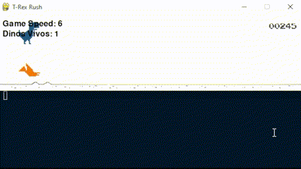

# Google DinoGame IA

Este repositório contém os códigos e documentação do projeto final da Unidade 01, no qual realizamos um treinamento de uma IA para jogar o jogo do dinossauro do google. Realizamos o treinamento de 2 IAs, a primeira de 2 camadas (Entrada[10] e Saida[1]) e a segunda de 3 camadas (Entrada[10], Escondida[5] e Saida[1]).


## Índice
- [Descrição do Projeto](#descrição-do-projeto)
- [Tecnologias Utilizadas](#tecnologias-utilizadas)
- [Execução](#execução)
  - [1. Rodar usando Python diretamente](#1-rodar-usando-python-diretamente)
  - [2. Rodando com Poetry](#2-rodando-com-poetry)
  - [3. Usando Makefile](#3---usando-makefile)
- [Treinamento e Escolha dos Algoritmos](#treinamento-e-escolha-dos-algoritmos)
  - [Estrutura do Algoritmo](#estrutura-do-algoritmo)
  - [Treinamento](#treinamento)
  - [Escolha do Melhor Agente](#escolha-do-melhor-agente)
- [Vídeos do Funcionamento](#vídeos-do-funcionamento)
  - [Múltiplas Camadas](#múltiplas-camadas)
    - [Inicio do Treinamento em Múltiplas Camadas](#inicio-do-treinamento-em-múltiplas-camadas)
    - [Metade do Treinamento em Múltiplas Camadas](#metade-do-treinamento-em-múltiplas-camadas)
    - [Final do Treinamento em Múltiplas Camadas](#final-do-treinamento-em-múltiplas-camadas)
    - [Melhor Agente em Múltiplas Camadas](#melhor-agente-múltiplas-camadas)
  - [Única Camada](#única-camada)
    - [Inicio do Treinamento em Única Camada](#inicio-do-treinamento-em-única-camada)
    - [Metade do Treinamento em Única Camada](#metade-do-treinamento-em-única-camada)
    - [Final do Treinamento em Única Camada](#final-do-treinamento-em-única-camada)
    - [Melhor Agente em Única Camada](#melhor-agente-única-camada)

## Descrição do Projeto

Este projeto utiliza algoritmos genéticos e redes neurais perceptron para treinar uma inteligência artificial (IA) capaz de jogar o famoso jogo do Dino, popular no navegador Google Chrome. O objetivo do projeto é evoluir uma população de dinossauros virtuais, permitindo que eles aprendam a desviar de obstáculos e maximizem sua pontuação, através da mutação de pesos da rede neural e seleção do melhor agente.

A IA é desenvolvida utilizando dois tipos de arquiteturas: redes neurais de única camada e redes neurais de múltiplas camadas. Os dinossauros são treinados utilizando o algoritmo genético, com um processo de evolução que seleciona o melhor agente de cada geração e aplica mutações aos pesos dos outros dinossauros para a próxima geração.

Este projeto também inclui scripts de teste que permitem verificar o desempenho do melhor agente treinado. Os arquivos .json armazenam os pesos do agente vencedor em diferentes arquiteturas, permitindo realizar testes posteriormente sem precisar re-treinar a IA.

## Tecnologias Utilizadas
- Python: Linguagem de programação principal do projeto.
- Algoritmo Genético: Utilizado para evoluir a população de dinossauros, permitindo que a IA aprenda com base em seleção natural e mutação.
- Redes Neurais Perceptron: Modelo de rede neural para tomar decisões baseadas nos estados do jogo.
- Poetry: Ferramenta para gerenciar dependências do projeto e ambientes virtuais.
- Makefile: Utilizado para facilitar a execução de comandos no terminal, como rodar testes e treinos.

## Execução

Para rodar o projeto, existem alguns métodos disponíveis:

### 1. Rodar usando Python diretamente
Certifique-se de estar na pasta ```/src/app``` antes de executar os comandos abaixo.

Para rodar o treinamento de múltiplas camadas:

    py mainMC.py

Para rodar o treinamento de única camada:

    py mainUC.py

Para rodar o melhor dinossauro treinado de múltiplas camadas:

    py testagentMC.py

Para rodar o melhor dinossauro treinado de única camada:

    py testagentUC.py

### 2. Rodando com Poetry
Se você estiver usando o ```Poetry``` para gerenciar suas dependências e ambientes virtuais, você pode executar os scripts diretamente usando os comandos ```poetry run```.

Para rodar o treinamento de múltiplas camadas:

    poetry run python src/app/mainMC.py

Para rodar o treinamento de única camada:

    poetry run python src/app/mainUC.py

Para rodar o melhor dinossauro treinado de múltiplas camadas:

    poetry run python src/app/testagentMC.py

Para rodar o melhor dinossauro treinado de única camada:

    poetry run python src/app/testagentUC.py

### 3 - Usando Makefile

O projeto inclui um ```Makefile``` para facilitar a execução de comandos. Você pode usar os seguintes comandos:

Para treinar um agente de única camada:

    make runtrainuc

Para treinar um agente de múltiplas camadas:

    make runtrainmc

Para rodar o melhor agente de única camada:

    make runuc

Para rodar o melhor agente de múltiplas camadas:

    make runmc


## Treinamento e Escolha dos Algoritmos

### Estrutura do Algoritmo

O projeto utiliza algoritmos de aprendizado de máquina para treinar agentes que jogam o jogo do Dino. Existem duas abordagens principais:

1. **Única Camada (Single Layer)**:
   - Esta abordagem utiliza um perceptron simples para tomar decisões com base no estado atual do jogo. Embora seja mais fácil de implementar e entender, ela pode não capturar a complexidade das situações que surgem durante a partida. Como resultado, o aprendizado tende a ter um desempenho inferior, especialmente nos primeiros momentos do jogo, onde, em alguns casos, o dinossauro pode acabar perdendo logo no início, mesmo com a IA já treinada.

2. **Múltiplas Camadas (Multi-Layer)**:
   - Esta abordagem utiliza uma rede neural com múltiplas camadas, permitindo que o agente aprenda representações mais complexas dos dados. Essa arquitetura geralmente resulta em um desempenho superior, especialmente em situações complicadas. Diferentemente da abordagem de única camada, os agentes treinados com múltiplas camadas demonstraram um desempenho melhor desde o início do jogo, permitindo uma adaptação mais eficaz aos desafios iniciais, mesmo com a IA já treinada.


### Treinamento

O treinamento dos agentes é realizado por meio de um algoritmo genético, que envolve as seguintes etapas:

- **Inicialização**: Um conjunto inicial de agentes é gerado com pesos aleatórios, criando uma diversidade de estratégias desde o início.
  
- **Avaliação**: Cada agente é testado em seu desempenho no jogo, e suas pontuações são coletadas para medir sua eficácia.

- **Seleção**: O agente com o melhor desempenho é escolhido para reprodução. Esse dinossauro é copiado para toda a população, garantindo que suas características sejam preservadas na próxima geração.

- **Mutação**: A mutação é aplicada aos pesos dos novos agentes gerados a partir do melhor. Essa etapa é crucial para introduzir variações e promover a diversidade genética, ajudando a evitar a convergência prematura e permitindo que a população explore uma gama mais ampla de estratégias.

- **Repetição**: O processo é reiterado por várias gerações, refinando constantemente os agentes até que um desempenho satisfatório seja alcançado. Esse ciclo contínuo de avaliação e adaptação resulta em um agente mais robusto e capaz de enfrentar os desafios do jogo.


### Escolha do Melhor Agente

Após o treinamento, o agente com a melhor pontuação é salvo em um arquivo JSON (por exemplo, `best_agentMC.json`). Esse agente pode ser carregado e utilizado em sessões de teste para verificar seu desempenho em tempo real.

Essa estrutura permite que os agentes aprendam e se adaptem, melhorando continuamente suas habilidades em jogar o jogo do Dino.


## Vídeos do Funcionamento
### Múltiplas Camadas
#### Inicio do Treinamento em Múltiplas Camadas
<p align="center">
    
</p>

#### Metade do Treinamento em Múltiplas Camadas
<p align="center">
    
</p>

#### Final do Treinamento em Múltiplas Camadas
<p align="center">
    
</p>

#### Melhor Agente Múltiplas Camadas
<p align="center">
    
</p>

### Única Camada
#### Inicio do Treinamento em Única Camada
<p align="center">
    
</p>

#### Metade do Treinamento em Única Camada
<p align="center">
    
</p>

#### Final do Treinamento em Única Camada
<p align="center">
    
</p>

#### Melhor Agente Única Camada
<p align="center">
    
</p>
